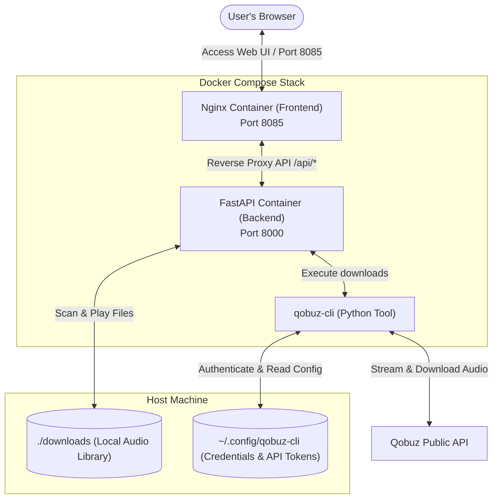

# 🎵 Qobuz Web Downloader Service

[](https://www.docker.com/)
[](https://fastapi.tiangolo.com/)
[](https://nginx.org/)
[](https://www.python.org/)

A fully self-hosted, containerized web application that wraps `qobuz-cli` inside a modern, glassmorphism-inspired web interface. Easily search, download, play, and organize your favorite Hi-Res music from Qobuz directly in your browser—**no command line interface required on your host machine!**

---

## 📸 Interface Preview & Features

- **✨ Modern Glassmorphism UI**: Beautiful, dark-themed responsive design tailored for desktops and mobile screens.
- **🔍 Seamless Search**: Browse through Qobuz's vast library for tracks, albums, and artists.
- **📥 One-Click Downloads**: Choose your preferred audio quality (from 320kbps MP3 all the way up to Hi-Res+ 24-bit/192kHz FLAC) and start downloads directly from the browser.
- **⏳ Real-Time Progress Tracker**: Monitor active downloads with progress bars and error reporting.
- **🎧 Built-in Media Library & Player**: Browse downloaded albums, stream audio directly in the web browser, or download files to your local device.

---

## 🏗️ Architecture Flow

The system runs entirely inside a Docker Compose stack. It isolates the Python backend and `qobuz-cli` tool, exposing only the Nginx frontend to your local network.



---

## 🚀 Getting Started

### 📋 Prerequisites
- **Docker** and **Docker Compose** installed on your system.

---

### 🔑 Step 1: Configure Qobuz Credentials (No Host CLI Required!)

Since this service interacts with the Qobuz API, it needs authentication tokens. You can securely initialize these directly through the Docker container without installing Python or `qobuz-cli` on your host.

1. **Create the configuration directory** on your host:
   ```bash
   mkdir -p ~/.config/qobuz-cli
   ```

2. **Run the interactive login command** inside the Docker container. This will temporarily mount the directory as read-write to save your generated config:
   ```bash
   docker compose run --rm -v ~/.config/qobuz-cli:/root/.config/qobuz-cli:rw backend qcli login
   ```

3. **Enter your Qobuz email and password** when prompted. The tool will authenticate with Qobuz, fetch the required API keys/tokens, and save a `config.ini` file into `~/.config/qobuz-cli/config.ini`.

> [!NOTE]
> If you already have `qobuz-cli` configured on your host machine, you can skip this step! The application will automatically pick up your existing credentials from `~/.config/qobuz-cli/config.ini`.

---

### 🐳 Step 2: Spin Up the Stack

With credentials initialized, start the services in detached mode:

```bash
docker compose up -d --build
```

---

### 🌐 Step 3: Access the Application

Once the containers are running:
1. Open your web browser and go to: **[http://localhost:8085](http://localhost:8085)**
2. Start searching, downloading, and playing your music!

---

## 📁 Downloads & File Structure

By default, downloads are saved to the `./downloads` folder inside this project directory. The folder is structured as follows:
```text
downloads/
└── Artist Name/
    └── Album Name/
        ├── 01 - Track Title.flac
        ├── 02 - Track Title.flac
        └── folder.jpg (Album Art)
```
You can point your Plex, Jellyfin, or local media server directly to this `./downloads` folder.

---

## 🛠️ Configuration & Port Customization

If you need to change ports or customize paths, edit the `docker-compose.yml` file:

- **Web Port**: To change the web UI port from `8085` to something else (e.g., `9000`), modify the ports binding in the frontend section or Nginx settings.
- **Storage Location**: To save downloads to an external hard drive, change the left side of the downloads volume mount:
  ```yaml
  volumes:
    - /path/to/your/music:/downloads
  ```

---

## ❓ Troubleshooting

### 1. `config.ini` Permission Errors
If you run into permission errors when starting the backend container, ensure that the folder `~/.config/qobuz-cli` and `config.ini` are readable by the user running Docker. You can fix ownership with:
```bash
sudo chown -R $USER:$USER ~/.config/qobuz-cli
```

### 2. Stream/Download Failures
- Ensure your Qobuz subscription is active and has the appropriate streaming tier (e.g. Studio/Sublime for Hi-Res quality).
- Check the backend logs to see if your account token has expired or if rate limits were triggered:
  ```bash
  docker compose logs -f backend
  ```

---

## ⚖️ Disclaimer
This tool is for personal use and archiving purposes only. Please respect artists and copyright laws. You must have an active Qobuz subscription to search and download tracks.

