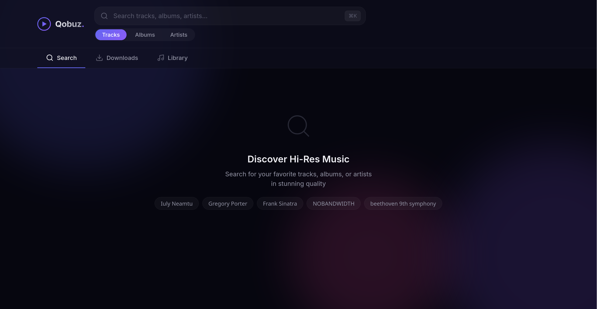
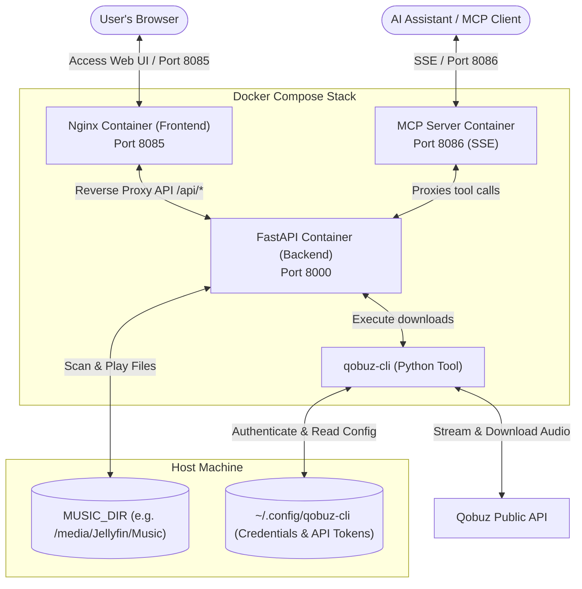

# 🎵 Qobuz Web Downloader Service

[](https://www.docker.com/)
[](https://fastapi.tiangolo.com/)
[](https://nginx.org/)
[](https://www.python.org/)
[](https://modelcontextprotocol.io/)

A fully self-hosted, containerized web application that wraps `qobuz-cli` inside a modern, glassmorphism-inspired web interface. Easily search, download, play, and organize your favorite Hi-Res music from Qobuz directly in your browser—**no command line interface required on your host machine!**

Now also ships a **Model Context Protocol (MCP) server**, letting AI assistants (Claude, Gemini, etc.) search Qobuz, queue downloads, and browse your library through natural language.

---

## 📸 Interface Preview & Features



- **✨ Modern Glassmorphism UI**: Beautiful, dark-themed responsive design tailored for desktops and mobile screens.
- **🔍 Seamless Search**: Browse through Qobuz's vast library for tracks, albums, and artists.
- **📥 One-Click Downloads**: Choose your preferred audio quality (from 320kbps MP3 all the way up to Hi-Res+ 24-bit/192kHz FLAC) and start downloads directly from the browser.
- **⏳ Real-Time Progress Tracker**: Monitor active downloads with progress bars and error reporting.
- **🎧 Built-in Media Library & Player**: Browse downloaded albums, stream audio directly in the web browser, or download files to your local device.
- **🤖 MCP Server**: Expose all downloader capabilities to AI assistants via the Model Context Protocol over SSE.

---

## 🏗️ Architecture Flow

The system runs entirely inside a Docker Compose stack. It isolates the Python backend and `qobuz-cli` tool, exposing only the Nginx frontend and the MCP server to your local network.



---

## 🚀 Getting Started

### 📋 Prerequisites
- **Docker** and **Docker Compose** installed on your system.

---

### ⚙️ Step 1: Configure Environment Variables

Create a `.env` file in the project root (it is gitignored by default). You can copy the example file as a starting point:

```bash
cp .env.example .env
```

Then edit `.env` to match your setup:

```env
# Absolute path on the host where music will be saved (e.g. your Music library)
MUSIC_DIR=/media/music/

# Port the web UI will be accessible on
APP_PORT=8085

# Port the MCP server will be accessible on
MCP_PORT=8086

# Secret token required to authenticate MCP clients (change this!)
MCP_TOKEN=qobuz_mcp_secure_secret_token_change_me
```

Adjust `MUSIC_DIR` to match your media library path. Set a strong, unique value for `MCP_TOKEN` — any MCP client must present this token to interact with the server.

---

### 🔑 Step 2: Configure Qobuz Credentials (No Host CLI Required!)

Since this service interacts with the Qobuz API, it needs authentication tokens. You can securely initialize these directly through the Docker container without installing Python or `qobuz-cli` on your host.

1. **Create the configuration directory** on your host:
   ```bash
   mkdir -p ~/.config/qobuz-cli
   ```

2. **Run the interactive login command** inside the Docker container. This will temporarily mount the directory as read-write to save your generated config:
   ```bash
   docker compose run --rm -v ~/.config/qobuz-cli:/config/.config/qobuz-cli:rw -e HOME=/config -u "$(id -u):$(id -g)" backend qcli login
   ```

3. **Enter your Qobuz email and password** when prompted. The tool will authenticate with Qobuz, fetch the required API keys/tokens, and save a `config.ini` file into `~/.config/qobuz-cli/config.ini`.

> [!NOTE]
> If you already have `qobuz-cli` configured on your host machine, you can skip this step! The application will automatically pick up your existing credentials from `~/.config/qobuz-cli/config.ini`.

---

### 🐳 Step 3: Spin Up the Stack

With credentials initialized, start the services in detached mode:

```bash
docker compose up -d --build
```

This starts three containers:
- **`qobuz-frontend`** — Nginx serving the web UI on `APP_PORT`
- **`qobuz-backend`** — FastAPI backend on port 8000 (internal)
- **`qobuz-mcp`** — MCP SSE server on `MCP_PORT`

---

### 🌐 Step 4: Access the Application

Once the containers are running:
1. Open your web browser and go to: **[http://localhost:8085](http://localhost:8085)**
2. Start searching, downloading, and playing your music!

---

## 🤖 MCP Server

The `qobuz-mcp` container exposes a [Model Context Protocol](https://modelcontextprotocol.io/) server over **Server-Sent Events (SSE)**. This lets any compatible AI assistant control the downloader service through natural language — searching Qobuz, queuing downloads, checking progress, and browsing your local library.

### Available Tools

| Tool | Description |
|---|---|
| `search_qobuz` | Search for tracks, albums, or artists by query |
| `get_album_details` | Get full tracklist and quality info for an album |
| `get_track_details` | Get metadata for a specific track |
| `download_music` | Queue a track or album download at a chosen quality |
| `list_downloads` | List all recent and active downloads |
| `get_download_status` | Get detailed status and progress of a specific download |
| `cancel_download` | Cancel a pending or active download |
| `list_library` | Browse the local downloaded music library |

### Authentication

All requests to the MCP server must include the `MCP_TOKEN` secret. Clients can pass it as:
- A `Bearer` token in the `Authorization` header
- An `X-MCP-Token` header
- A `token` query parameter

The `/health` endpoint is publicly accessible (no token required) and can be used to verify the server is running.

### Connecting an AI Client

#### Claude Desktop

Add the following to your `claude_desktop_config.json`:

```json
{
  "mcpServers": {
    "qobuz": {
      "url": "http://localhost:8086/sse",
      "headers": {
        "Authorization": "Bearer YOUR_MCP_TOKEN"
      }
    }
  }
}
```

#### Generic MCP Client (SSE endpoint)

```
SSE Endpoint:  http://localhost:8086/sse
Auth Header:   Authorization: Bearer YOUR_MCP_TOKEN
```

Replace `YOUR_MCP_TOKEN` with the value of `MCP_TOKEN` from your `.env` file.

> [!WARNING]
> Do not expose `MCP_PORT` to the public internet without an additional layer of security (e.g. a VPN or reverse proxy with TLS). The MCP server has full control over downloads and your music library.

---

## 📁 Downloads & File Structure

Downloads are saved to the host path defined by `MUSIC_DIR` in your `.env` file (default: `/media/music`). The folder is structured as follows:
```text
$MUSIC_DIR/
└── Artist Name/
    └── Album Name/
        ├── 01 - Track Title.flac
        ├── 02 - Track Title.flac
        └── folder.jpg (Album Art)
```
Point your Jellyfin or Plex music library directly at the `MUSIC_DIR` path.

---

## 🛠️ Configuration

All runtime settings are controlled via the `.env` file in the project root:

| Variable | Default | Description |
|---|---|---|
| `MUSIC_DIR` | `/media/music` | Host path where downloads are saved |
| `APP_PORT` | `8085` | Port the web UI is exposed on |
| `MCP_PORT` | `8086` | Port the MCP SSE server is exposed on |
| `MCP_TOKEN` | *(none)* | Secret token required by MCP clients. If unset, auth is **disabled** (not recommended) |

Edit `.env` and restart the stack (`docker compose up -d`) for changes to take effect.

---

## ❓ Troubleshooting

### 1. `config.ini` Permission Errors
If you run into permission errors when starting the backend container, ensure that the folder `~/.config/qobuz-cli` and `config.ini` are readable by the user running Docker. You can fix ownership with:
```bash
sudo chown -R $USER:$USER ~/.config/qobuz-cli
```

### 2. Stream/Download Failures
- Ensure your Qobuz subscription is active and has the appropriate streaming tier (e.g. Studio/Sublime for Hi-Res quality).
- Check the backend logs to see if your account token has expired or if rate limits were triggered:
  ```bash
  docker compose logs -f backend
  ```

### 3. MCP Server Not Responding
- Verify the container is running: `docker compose ps`
- Check MCP server logs: `docker compose logs -f mcp`
- Confirm your client is sending the correct `MCP_TOKEN` value.
- The health endpoint should return `200 OK` if the server is up:
  ```bash
  curl http://localhost:8086/health
  ```

---

## ⚖️ Disclaimer
This tool is for personal use and archiving purposes only. Please respect artists and copyright laws. You must have an active Qobuz subscription to search and download tracks.
